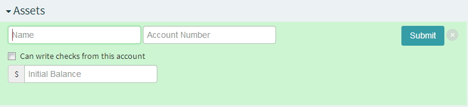
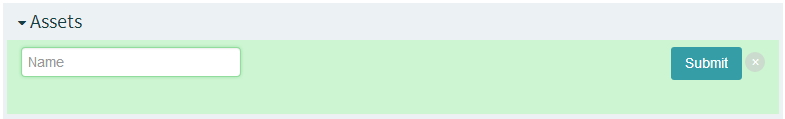
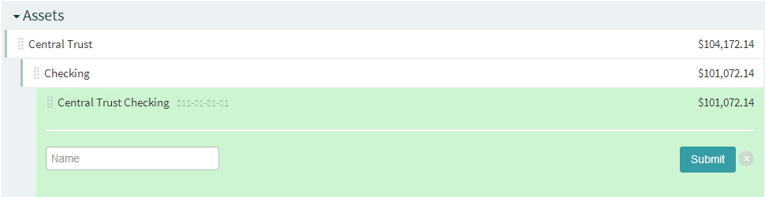
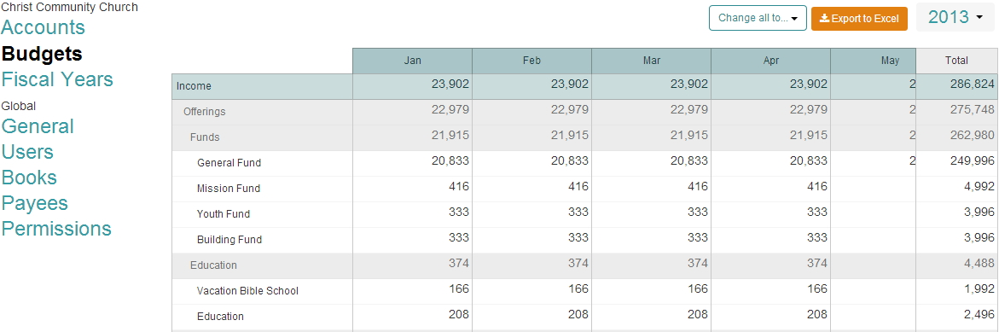
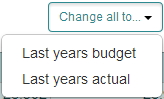
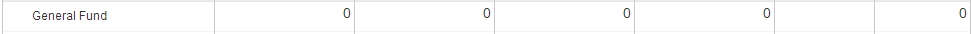
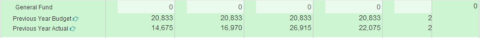
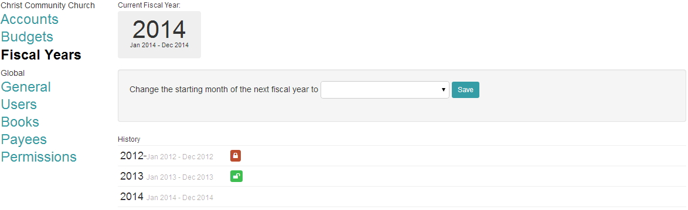

### Accounts
- Assets, Liabilities, Income and Expense Accounts are entered here

**New Account** - used to create a new account

* **Assets** - enter the Account Name, Account Number (optional), choose if the account can be used to write checks and enter the Initial Balance 
* **Liabilities** - enter the Account Name, Account Number (optional) and enter the Initial Balance 
* **Income** - enter the Account Name, Account Number (optional)
* **Expense** - enter the Account Name, Account Number (optional)
      
**New Category** - used to create a new category

* **Assets** - enter the category name
* **Liabilities** - enter the category name
* **Income** - enter the category name
* **Expense** - enter the category name

**Restricted Account** - Restricted Funds are a reserve of money that can only be used for specific purposes.  These accounts are tied to specific Asset Accounts.

* **Assets** - enter the Restricted Account name
  
**Moving Accounts/Categories**

* **Accounts/Categories** are placed by left clicking on the account/category and dragging it to the appropriate location.  After all changes have been made click on Confirm to save the changes

* **Note:** initial balances can not be changed once a transaction has been entered.  Confirming Balances just confirms the balance that you entered.  Initial Balances are able to be changed until the first transaction has been entered.

### Budgets
- Used to enter budgets for your selected fiscal year.  We have three options to enter in the budget numbers.

* **Option 1** - Change all to option will allow you to set your budget numbers based on Last years budget or Last years actual.

* **Option 2** - Manually typing in the amount in each individual box

* **Option 3** - Clicking on a single account (income or expense) and using Previous Year Budget or Previous Year Actual.

* **Export to Excel** - takes the budget information and exports it out to excel
* **Date Picker** - used to select which fiscal year you are entering your budget numbers for

### Fiscal Years 
- Displays current fiscal year, allows you to set the starting month for the next fiscal year and shows any prior fiscal years that you might have.

* **Change the starting month of the next fiscal year to** - used to chose the starting month for your next fiscal year.
* **History** - shows prior fiscal years that you might have.  Fiscal years can be locked or unlocked from here as well.  Clicking on the Green lock will lock the fiscal year and change it to a red lock.  Once this has been done you will not be able to enter transactoins for that fiscal year.  
* **Note:** only the Administrator is able to lock/unlock fiscal years.
