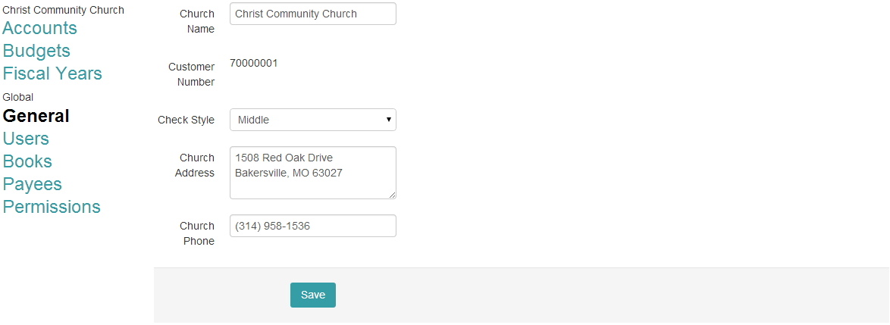
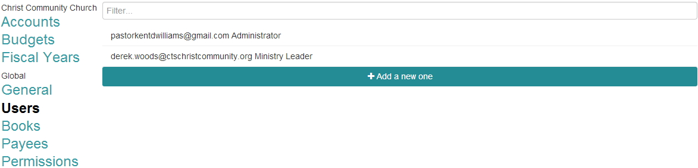
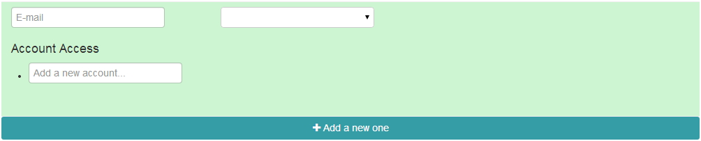
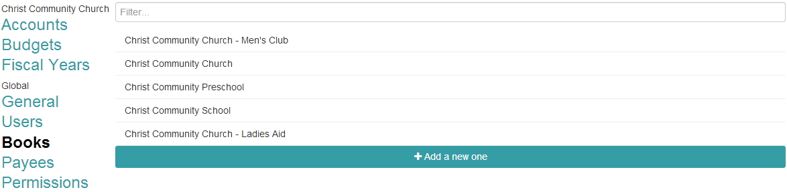
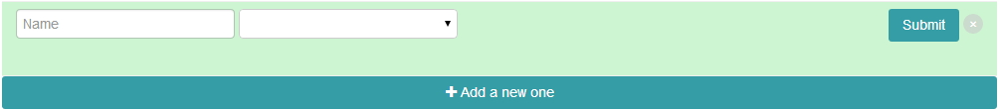
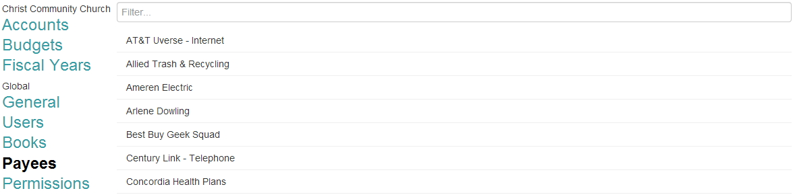
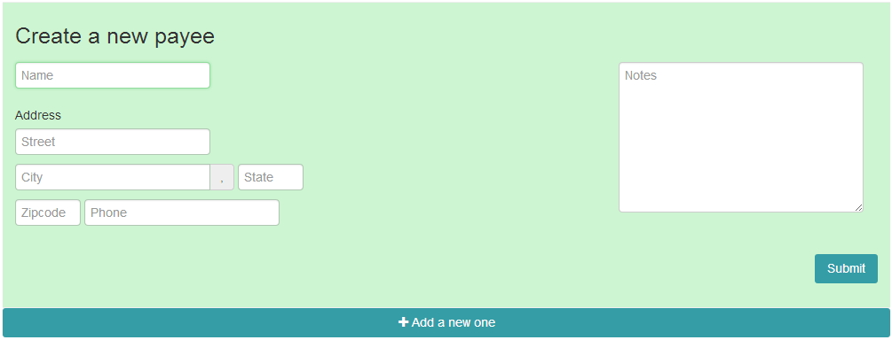
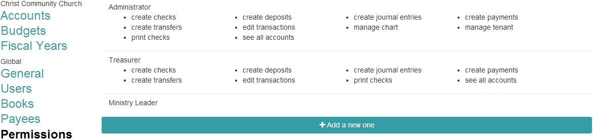
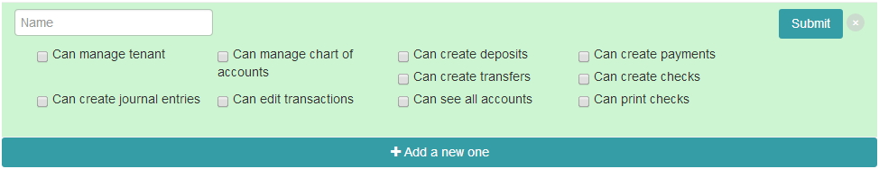

Global Settings

# General
- shows basic information for your church

* **Church Name** - enter your church name here
* **Customer Number** - automatically added
* **Check Style** - middle check (check is in the middle) or top check (check is on the top).  Checks can be ordered from http://www.formsplusinc.com/category/church-supplies
* **Church Address** - enter your church address here
* **Church Phone** - enter your church phone number here

# Users
- shows current users for your site and allows you to add a new users

* **Filter** - used to search for a particular users
* **Add a new one** is used to add a new user to your site.  Enter in the email address and the permission level that you want the user to have.  Account Access is used to give the user(s) access to specific account(s).  Once finsihed click on submit to add the new user.

# Books
- shows your current books and allows you to create a new one

* **Filter** - used to search for a particular book
* **Add a new one** is used to add a new book.  Enter the new Book name and the starting month for the fiscal year.  Once you are done with that click submit to add the new book.

# Payees
- used to enter new payes and view current ones

* **Filter** - used to search for a particular payee
* **Add a new one** allows you to add a new payee.  Enter in the Payee name (required), Address (optional) and Notes (optional).  Click submit to save the new payee.

* **Payee History** - hovering your mouse over a Payee will show the History icon.  Clicking on that will open a new screen that will show your transcation information for that Payee.  You are able to adjust the date range using the date picker.  You also have the option to print this view or export the information out to excel.

# Permissions
- allows you to set permission levels for users of your site

* **Administrator** - this permission level is permanent.  Changes can not be made to this permission group.
* **Add a new one** will allow you to create a new permissions group.  Enter the name of the permission group and select the options for that group.

* **Permission options**
 * **Can manage tenant** - allows you to manage books
  *   **Can manage chart of acounts** - allows you manage the chart of accounts (add/edit/place accounts)
  *   **Can create deposits** - allows the user to enter deposits
  *   **Can create payments** - allows the user to enter payments
  *   **Can create transfers** - allows the user to enter transfers
  *   **Can create checks** - allows the user to enter checks
  *   **Can create journal entries** - allows the user to enter journal entries
  *   **Can edit transactions** - allows the user to edit transactions
  *   **Can see all accounts** - allows the user to see all accounts that are in the system
  *   **Can print checks** - allows the user to print checks

