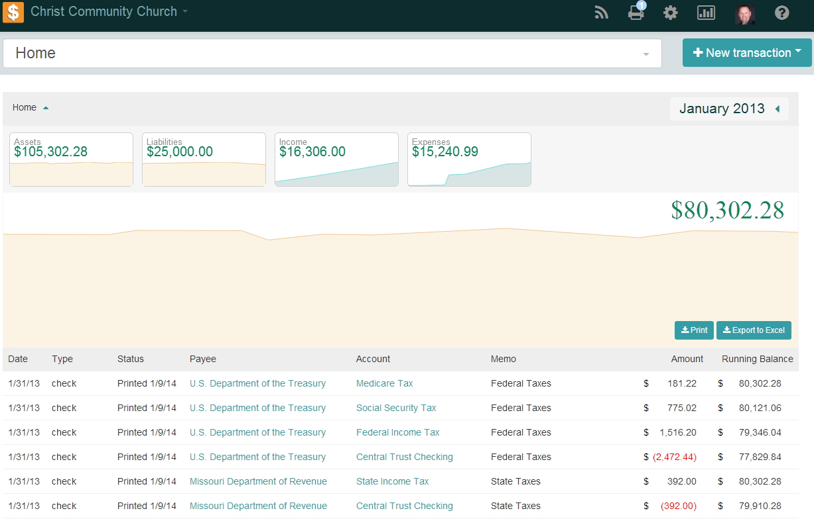
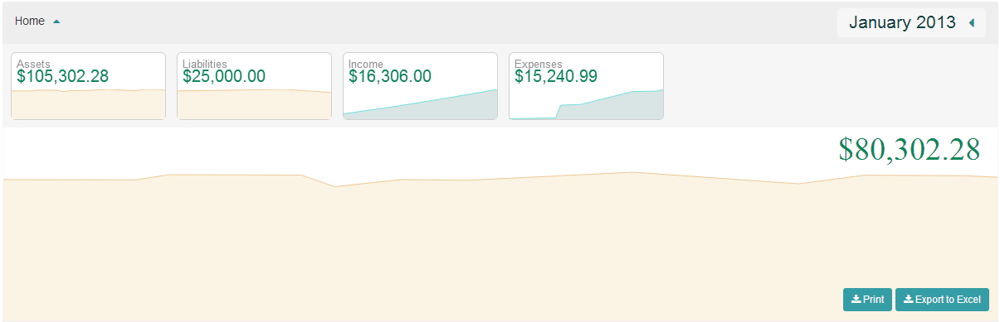

After logging in, the Home Screen will load:

Navigation Bar

    Home Button - Clicking on this button will take you to the Home page
    Book - shows your current Book and allows you to select another Book
    Contributions - if you have a 360 Members site this will allow you to bring in offerings
    Print - used to print checks
    Settings - contains the Book and General Settings
    Reports - used to print reports and the event log
    User settings - used to log out and change your password
    Help - help section
    Omni Bar - allows you to search for a particular account
    New transaction - used to enter our transactions (transfer, deposit, payment, check, journal entry)

Graphs

    Date Picker - allows you to change the date range to a particular date
    Mini Graph - gives a snap shot of our account types
    Running Balance Graph - shows the difference between our Assets and Liabilities
    Print - will print the transactions
    Export - exports the transactions to excel
    Ledger - list of transactions based on the date picker range
    Feedback - used to leave feedback for support