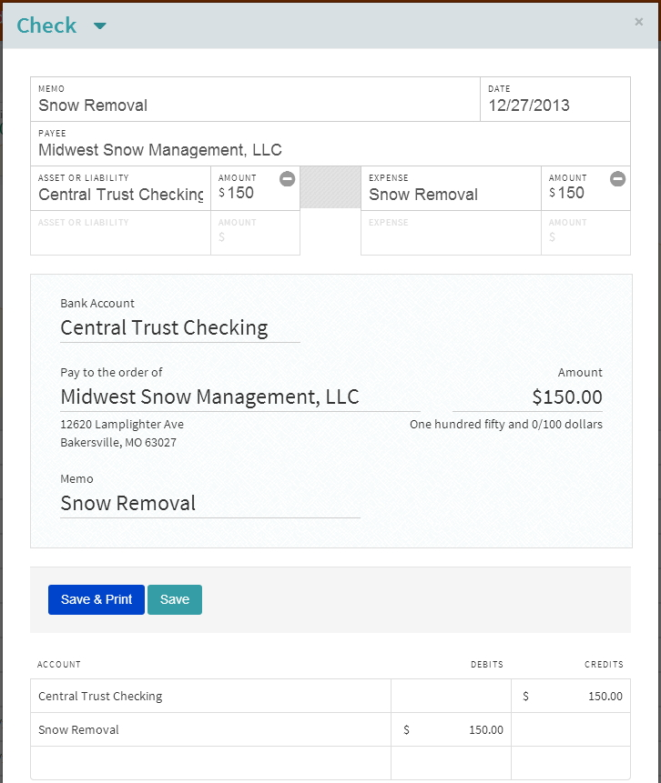

### New Transaction
is used to add transactions into the system.  We have five transaction types

### Transfer
- used to tranfer money between similar account types (Asset to Asset, Liability to Liabiity, Income to Income and Expense to Expense)

* **Memo** - optional
* **Date** - opens a calendar to select the date, can manually type in the date as well
* **Asset**, **Expense**, **Income** or **Liability** - enter your first account
* **Amount** - enter the amount for account 1
* **Asset**, **Expense**, **Income**, **Liability** - enter the second account
* **Amount** - enter the amount for account 2
* **Save** - saves the transaction to the system
* **Note:** Debits and Credits must equal before the transaction can be saved.

### Deposit
* used to add money to your Asset accounts.  Asset and Income accounts are the only accounts that can be used here.

* **Memo** - optional
* **Date** - opens a calendar to select the date, can manually type in the date as well
* **Payee** - optional
* **Asset** - enter your asset account
* **Amount** - enter the amount for your asset account
* **Income** - enter the income account
* **Amount** - enter the amount for your income account
* **Save** - saves the transaction to the system

### Payment
* used to enter transcations that might be web based or even cash purchases.  Only Assets, Liabilities and Expense are able to be used with Payments.

* **Memo** - optional
* **Date** - opens a calendar to select the date, can manually type in the date as well
* **Payee** - optional
* **Asset** or **Liability** - enter your asset or liability account
* **Amount** - enter the amount for your asset or liability account
* **Expense** or **Liability** - enter the expense or liability account
* **Amount** - enter the amount for your expense or liability account
* **Save** - saves the transaction to the system

### Check
* used to pay bills, employees and other similar type transactions.  Checks will be limited to Assets, Liabilities and Expenses.

* **Memo** - optional
* **Date** - opens a calendar to select the date, can manually type in the date as well
* **Payee** - enter the payee's name here
* **Asset** or **Liability** - enter your asset or liability account
* **Amount** - enter the amount for your asset or liability account
* **Expense** or **Liability** - enter the expense or liability account
* **Amount** - enter the amount for your expense or liability account
* **Save & Print** - saves the transaction to the system and takes you to the print check screen
* **Save** - saves the check to the system to print at a later time

### Journal Entry
* will mainly be used for correction purposes.  For instance you noticted that a payment was off a few dollars you would simply do a Journal entry to make changes to the affected accounts.

* **Memo** - optional
* **Date** - opens a calendar to select the date, can manually type in the date as well
* **Payee** - optional
* **Account** - enter the account that needs to be correct
* **Debits** or **Credits** - enter the amount of the correction
* **Save** - saves the transaction to the system

