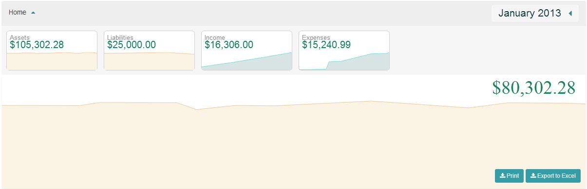

### Home Screen

### Navigation Bar

  * **Home Button** - Clicking on this button will take you to the Home page
  * **Book** - shows your current Book and allows you to select another Book
  * **Contributions** - if you have a 360 Members site this will allow you to bring in offerings
  * **Print** - used to print checks
  * **Settings** - contains the Book and General Settings
  * **Reports** - used to print reports and the event log
  * **User settings** - used to log out and change your password
  * **Help** - help section
  * **Omni Bar** - allows you to search for a particular account

  * **New transaction** - used to enter our transactions (transfer, deposit, payment, check, journal entry)

### Graphs

  * **Date Picker** - allows you to change the date range to a particular date. Options include Fiscal Year, Quarters (Q1, Q2, Q3, Q4), Month Selection and manual selection.

  * **Mini Graph** - displays a snap shot of your account types.  Clicking on anyone of these graphs will drill down into the individual accounts.  Changes made here will effect the running balance graph.

  * **Running Balance Graph** - shows the difference between our Assets and Liabilities.  Hovering your mouse over a point on the graph will show information at the point in time.  If you are looking at Income or Expense accounts you see the budget line.  This will show you how well your account is doing verse your budget numbers.

  * **Print** - will print the transactions
  * **Export** - exports the transactions to excel
  * **Ledger** - list of transactions based on the date picker range

  * **Feedback** - used to leave feedback for support

