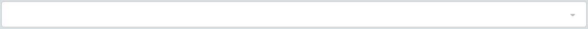

### Home Screen

### Navigation Bar

  * **Home Button** - Clicking on this button will take you to the Home page
  * **Book** - shows your current Book and allows you to select another Book
  * **Contributions** - if you have a 360 Members site this will allow you to bring in offerings
  * **Print** - used to print checks
  * **Settings** - contains the Book and General Settings
  * **Reports** - used to print reports and the event log
  * **User settings** - used to log out and change your password
  * **Help** - help section
  * **Omni Bar** - allows you to search for a particular account

  * **New transaction** - used to enter our transactions (transfer, deposit, payment, check, journal entry)

### Graphs

  * **Date Picker** - allows you to change the date range to a particular date

  * **Mini Graph** - gives a snap shot of our account types

  * **Running Balance Graph** - shows the difference between our Assets and Liabilities

  * **Print** - will print the transactions
  * **Export** - exports the transactions to excel
  * **Ledger** - list of transactions based on the date picker range

  * **Feedback** - used to leave feedback for support

