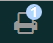
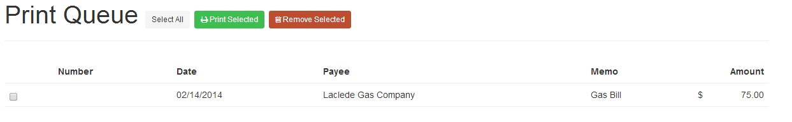
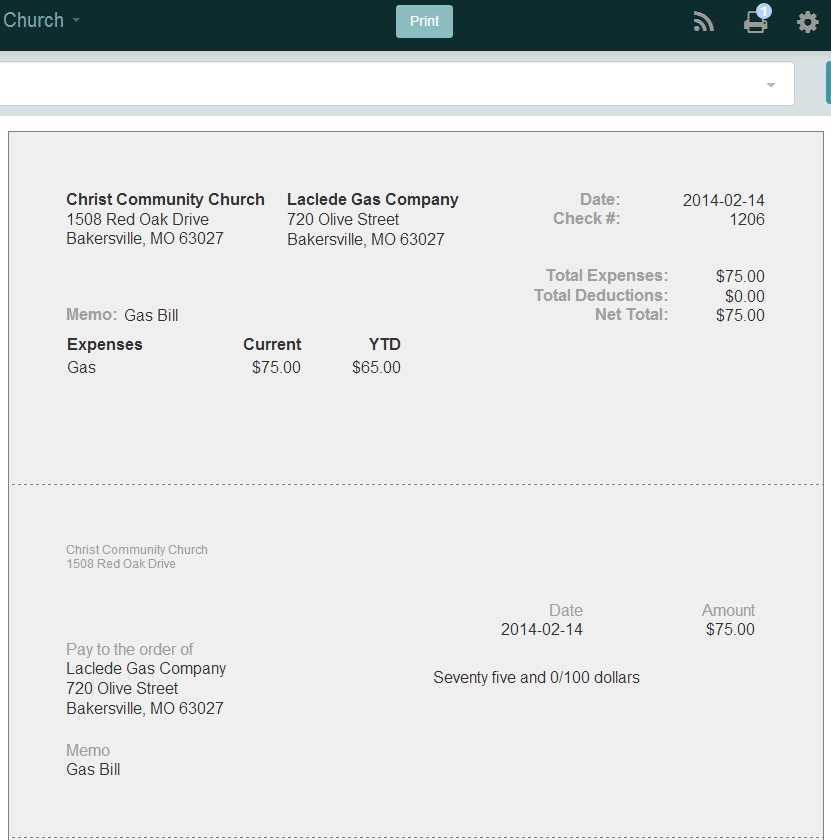
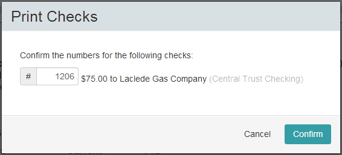
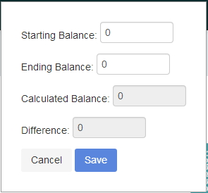
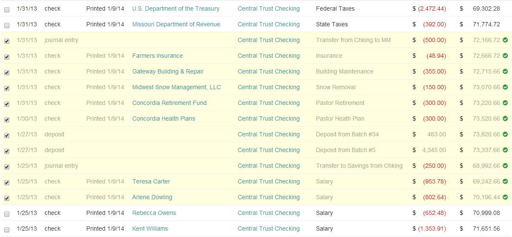

### Access Check Printing

* To access the print queue click on the printer icon in the admin toolbar.  The print icon will also display the number of checks that you have to print.

### Print Queue

* **Select All** - allows you to choose all checks that you have listed.  Checks can still be checked one at a time as well.
* **Print Selected** - prints the checks that you have selected
* **Removed Selected** - removeds the checsk that you have selected from the queue

### Printing a Check

* From the print preview window verify that the checks look correct and then click on the Print button.
* Enter the check number then click on Confirm

* Verify that everything looks correct then click on print.
* Once you are finsihed printing the check click on Remove Selected to remove it from the list.

### Reconciling Accounts
* Reconciling an account is used as a means of proving or documenting that an account balance is correct. 

* Starting from the Home Page you will click on Assets and continue to click until you have selected the Asset account that you are wanting to Reconcile.
* Using the Date Picker select the date range using the customer range.
* Once at the Account level you will now see the option to Reconcile.
* Click on the Reconcile Button.  This opens a new window.
* Enter your Starting Balance, Ending Balance.  These will match the amounts show on your statement.
* Looking at the list of transactions check each transaction that appears on your statement.
* Once that is done Click on Save to save the reconciliation.

