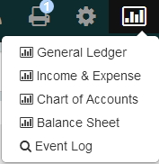
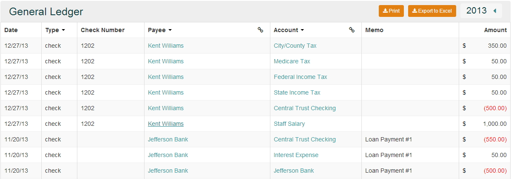
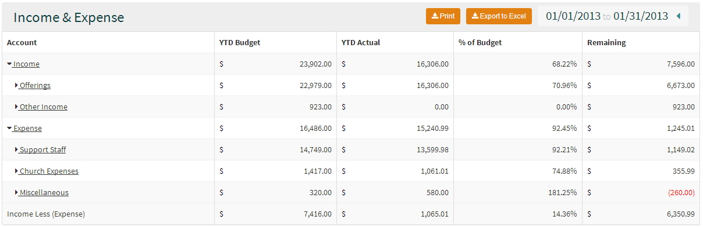
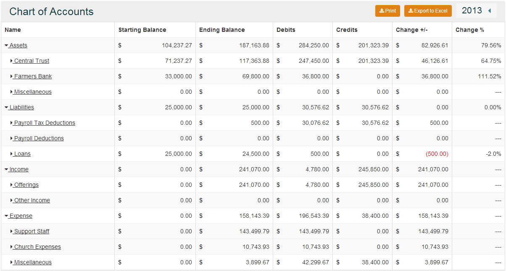
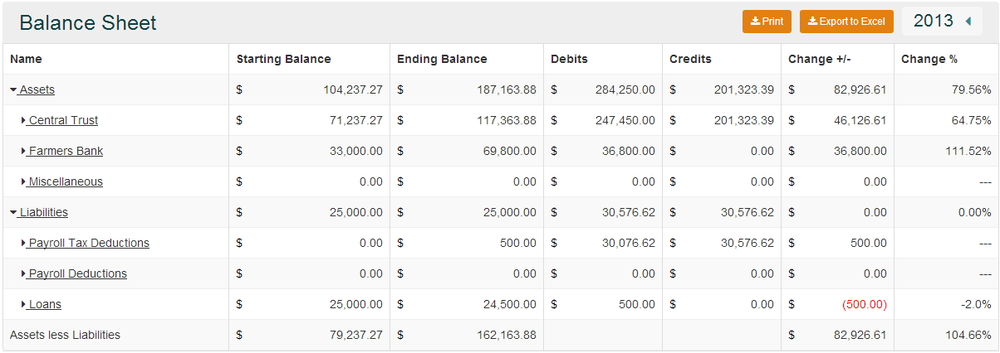

### Reports and Event Log

360 Ledger Reports is comprised of 4 separate reports and the Event Log
* **General Ledger** - the General Ledger report allows you to get a report for Checks, Journal Entries and Deposits.  
* **Income & Expense** - the Income & Expense report gives you a report of all income and expense accounts that you have.
* **Chart of Accounts** - the Chart of Accounts Report gives you a report that shows starting and ending balances for all account types.
* **Balance Sheet** - the Balance Sheet report gives you a report for Asset and Liability accounts only.
* **Event Log** - is used to keep track of what is happening in 360 Ledger.  Everytime you enter a transactions, edit a transcations, print checks or create/edit payess the Event Log will track these changes.

### General Ledger

* **By Type** - using this option will allow you to pick a single transaction type or a combination of the transactions.
* **Payee** - using this option will allow you choose a single Payee or a combination of Payees.
* **Group by Payee** - using this option will group the transactions by Payee.  Note using this option no longer allows the Group by Account option
* **Account** - using this option will allow you to sort by  specific Accounts or a combination of Accounts.
* **Group by Account** - using the group by account option will group your transactions by account.  Note using this option no longer allows the use of the Group by Payee.
* **Print** - using the print option prints out the report for you
* **Export to Excel** - using the export option will send the report to excel
* **Date Picker** - used to select the specific time frame for you report (Fiscal Year, Month or Quarter).

### Income & Expense

* **YTD Budget** - displays your budget amounts year to date( current month inluding any prior months) 
* **YTD Actual** - displays your actual income year to date( current month inluding any prior months) 
* **% of Budget** - compares your YTD Actual to your YTD Budget and gives you a percentage
* **Remaining** - shows the difference between your YTD Acutal and YTD Budget and gives you an amount
* **Print** - using the print option prints out the report for you
* **Export to Excel** - using the export option will send the report to excel
* **Date Picker** - used to select the specific time frame for you report (Fiscal Year, Month or Quarter).
* **Income Less (Expense)** - gives you the difference between your Income and Expense

### Chart of Accounts

* **Starting Balance** - shows the starting balance based on teh the selected date range
* **Ending Balance** - shows the ending balance based on the selected date range
* **Debits** - shows the total debits for the selected date range
* **Credits** - shows the total credits for the selected date range
* **Change +/-**  - displays the difference between the starting and ending balance
* **Change %** - displays the difference between the starting and ending balance
* **Print** - using the print option prints out the report for you
* **Export to Excel** - using the export option will send the report to excel
* **Date Picker** - used to select the specific time frame for your report (Fiscal Year, Month or Quarter).

### Balance Sheet

* **Starting Balance** - shows the starting balance based on the the selected date range
* **Ending Balance** - shows the ending balance based on the selected date range
* **Debits** - shows the total debits for the selected date range
* **Credits** - shows the total credits for the selected date range
* **Change +/-**  - displays the difference between the starting and ending balance
* **Change %** - displays the difference between the starting and ending balance
* **Assets less Liabilities** - display the difference between Assets and Liabilities
* **Print** - using the print option prints out the report for you
* **Export to Excel** - using the export option will send the report to excel
* **Date Picker** - used to select the specific time frame for your report (Fiscal Year, Month or Quarter).
