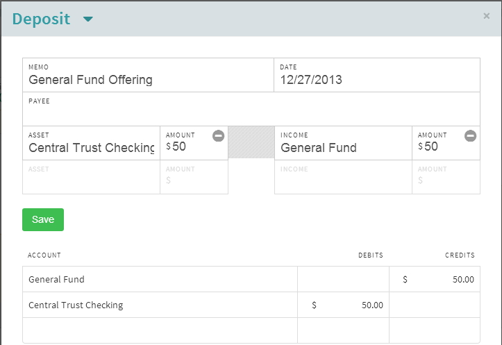
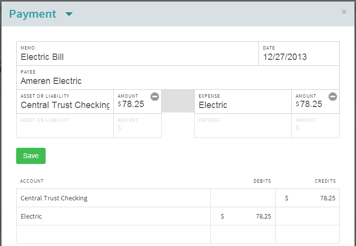
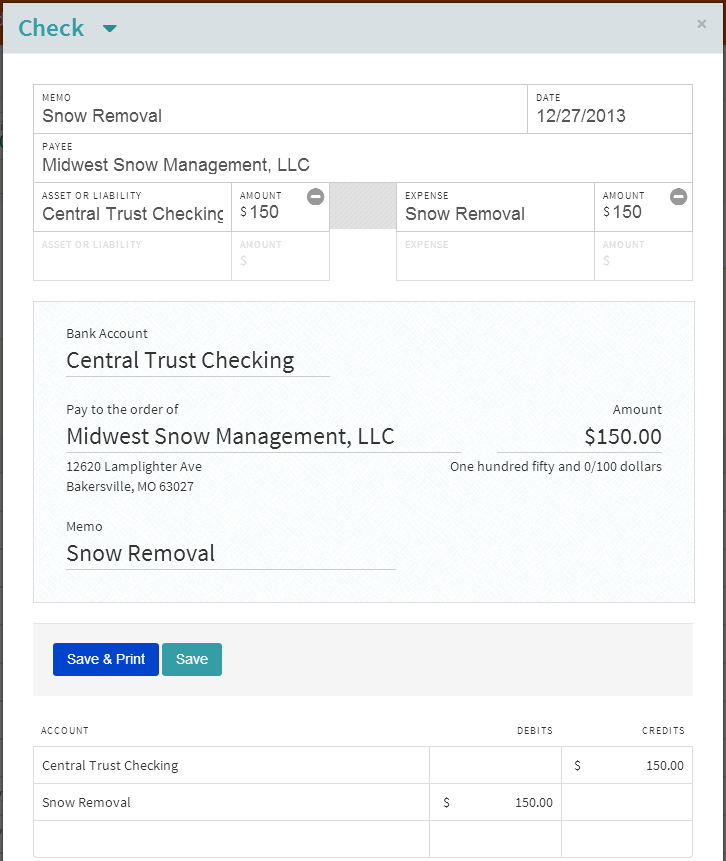
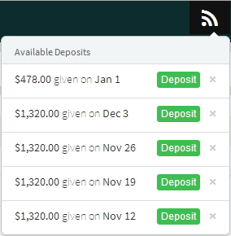

### + New Transaction
is used to add transactions into the system.  We have five transaction types

### Transfer
- used to tranfer money between similar account types (Asset to Asset, Liability to Liabiity, Income to Income and Expense to Expense)

* **Memo** - optional
* **Date** - opens a calendar to select the date, can manually type in the date as well
* **Asset**, **Expense**, **Income** or **Liability** - enter your first account
* **Amount** - enter the amount for account 1
* **Asset**, **Expense**, **Income**, **Liability** - enter the second account
* **Amount** - enter the amount for account 2
* **Save** - saves the transaction to the system
* **Note:** Debits and Credits must equal before the transaction can be saved.

### Deposit
* used to add money to your Asset accounts.  Asset and Income accounts are the only accounts that can be used here.

* **Memo** - optional
* **Date** - opens a calendar to select the date, can manually type in the date as well
* **Payee** - optional
* **Asset** - enter your asset account
* **Amount** - enter the amount for your asset account
* **Income** - enter the income account
* **Amount** - enter the amount for your income account
* **Save** - saves the transaction to the system

### Payment
* used to enter transcations that might be web based or even cash purchases.  Only Assets, Liabilities and Expense are able to be used with Payments.

* **Memo** - optional
* **Date** - opens a calendar to select the date, can manually type in the date as well
* **Payee** - optional
* **Asset** or **Liability** - enter your asset or liability account
* **Amount** - enter the amount for your asset or liability account
* **Expense** or **Liability** - enter the expense or liability account
* **Amount** - enter the amount for your expense or liability account
* **Save** - saves the transaction to the system

### Check
* used to pay bills, employees and other similar type transactions.  Checks will be limited to Assets, Liabilities and Expenses.

* **Memo** - optional
* **Date** - opens a calendar to select the date, can manually type in the date as well
* **Payee** - enter the payee's name here
* **Asset** or **Liability** - enter your asset or liability account
* **Amount** - enter the amount for your asset or liability account
* **Expense** or **Liability** - enter the expense or liability account
* **Amount** - enter the amount for your expense or liability account
* **Save & Print** - saves the transaction to the system and takes you to the print check screen
* **Save** - saves the check to the system to print at a later time

### Journal Entry
* will mainly be used for correction purposes.  For instance you noticted that a payment was off a few dollars you would simply do a Journal entry to make changes to the affected accounts.

* **Memo** - optional
* **Date** - opens a calendar to select the date, can manually type in the date as well
* **Payee** - optional
* **Account** - enter the account that needs to be correct
* **Debits** or **Credits** - enter the amount of the correction
* **Save** - saves the transaction to the system

### Contributions from 360 Members

* Contributions from 360 Members are able to be imported over to 360 Ledger.   Contributions will be date and event specific.
* **Note:** When depositing contributions from 360 Members you will see which Fund the money was given to.  This will help you decide which Fund the money was given to.  This process is completely optional.  If you do not wish to add the deposits simply click the x to remove it from the list.

